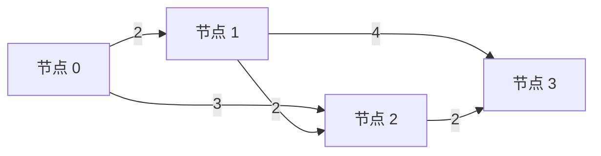

# 用一道力扣题串起 BFS、DFS 和 DP：3543. K 条边路径的最大边权和

整理日期：2026-10-07。代码使用 Python 3.9+，按 **BFS → DFS → 记忆化 DFS → DP** 的顺序阅读。

这篇笔记的目标：以后遇到一道搜索或动态规划题，能自己回答“状态是什么、下一步怎么走、什么时候停、哪些重复计算可以省掉”，再把答案填进模板。

## 1. 为什么选这道题

选题是 [力扣 3543. K 条边路径的最大边权和](https://leetcode.cn/problems/maximum-weighted-k-edge-path/)，难度为中等。它出自 **2025-05-10 的第 156 场双周赛**，适合作为较新的练习题。题目归属可以查看 [LeetCode 官方赛事介绍](https://leetcode.com/discuss/post/6731174/biweekly-contest-156-by-leetcode-z6nb/)，日期可以查看 [力扣官方赛事数据](https://leetcode.cn/contest/api/info/biweekly-contest-156/)。

它适合对照三种方法，是因为“走了几条边”天然就是一层：

| 方法 | 通俗理解 | 本题怎么用 |
| --- | --- | --- |
| BFS，广度优先搜索 | 所有路线先走一步，再一起走第二步 | 枚举恰好走到第 `k` 层的状态 |
| DFS，深度优先搜索 | 先把一条路线走下去，回来再试另一条 | 枚举每条恰好有 `k` 条边的路线 |
| DP，动态规划 | 把重复的问题合并，保存有用的结果 | 记录每层、每个节点能达到哪些权重和 |

**BFS 和 DFS 决定搜索顺序；DP 决定如何保存、复用子问题。** 它们可以结合使用，记忆化 DFS 本身就是一种 DP。本题的 BFS 去重也体现了“合并相同状态”的思想。

## 2. 题目描述：用自己的话说

有 `n` 个节点，编号为 `0` 到 `n - 1`。`edges` 中的 `[u, v, w]` 表示一条从 `u` 到 `v`、权重为 `w` 的有向边。图是 **有向无环图**：只能按箭头走，不能绕一圈回到自己。

你可以从任意节点开始，寻找一条路线，要求：

1. **恰好走 `k` 条边**。
2. **边权和严格小于 `t`**。
3. 在满足前两条的路线里，让边权和尽可能大。

返回最大的边权和；没有符合条件的路线就返回 `-1`。这些规则和下面的约束依据 [力扣原题](https://leetcode.cn/problems/maximum-weighted-k-edge-path/)。

主要约束：

- `1 <= n <= 300`，`0 <= len(edges) <= 300`。
- 每条边的权重在 `1` 到 `10` 之间。
- `0 <= k <= 300`，`1 <= t <= 600`。
- 没有重复的边，输入保证是有向无环图。

把它想成：**沿箭头走路，必须走够指定的段数，总重量不能碰到上限，最后尽量多拿。**

### 2.1 贯穿全文的例子

下面是自编教学例子，三种解法都用它：

```text
n = 4
edges = [[0, 1, 2], [0, 2, 3], [1, 2, 2], [1, 3, 4], [2, 3, 2]]
k = 2
t = 6
答案 = 5
```



箭头上的数字是边权。即使阅读器不显示图，也可以直接看路径表：

| 恰好两条边的路线 | 权重和 | 是否符合 `< 6` |
| --- | --- | --- |
| `0 → 1 → 2` | `2 + 2 = 4` | 是 |
| `0 → 1 → 3` | `2 + 4 = 6` | 否，等于上限也不行 |
| `0 → 2 → 3` | `3 + 2 = 5` | 是 |
| `1 → 2 → 3` | `2 + 2 = 4` | 是 |

所以返回 `5`。路线不必从 `0` 开始，也不必在 `n - 1` 结束。

### 2.2 先把三个边界想明白

- `k = 0`：站在任何节点，不走边，权重和是 `0`。因为 `t >= 1`，答案就是 `0`。
- 还没有走够 `k` 条边就无路可走：这条路线失败，不能提前拿它的权重作为答案。
- 权重和已经 `>= t`：后面的边权都是正数，只会继续增大，可以立刻停止这条路线。

还有两个可选的提前判断：无环图中最多走 `n - 1` 条边，所以 `k >= n` 无解；每条边至少重 `1`，所以 `k >= t` 也无解。下面的完整解法都包含这两个判断。

## 3. 写模板之前，先把“状态”找对

**状态就是：描述“现在走到哪里了”，并且足以决定接下来怎么走的信息。**

本题使用三个量：

```text
(u, steps, total)

u      = 当前节点
steps  = 已经走过的边数
total  = 已经积累的边权和
```

为什么不能只记录节点 `u`？

- 到同一个节点，走过的边数不同，距离“恰好 `k` 条边”就不同。
- 到同一个节点，累计权重不同，剩余可用的重量额度就不同。

为什么不需要记住整条路线？因为本题只求一个数值，后续能走哪些边由 `u` 决定，还能走几步由 `steps` 决定，重量限制由 `total` 决定。输入又是无环图，不会走回已经经过的节点。

三种解法共用同一条转移规则。若存在边 `u → v`，权重是 `w`：

```text
当前状态：(u, steps, total)
下一状态：(v, steps + 1, total + w)
合法条件：steps < k，且 total + w < t
```

也共用同一组起点和终点：

```text
初始状态：对每个节点 u，建立 (u, 0, 0)
成功状态：steps == k，并且 total < t
最终答案：所有成功状态中的最大 total
```

如果两个状态的这三个量完全相同，那么后面能得到的结果相同，可以合并。**合并状态，不等于把到同一个节点的所有路线都合并。**

## 4. BFS：所有路线一层一层走

### 4.1 先理解队列

队列就是排队：先进去的先出来。Python 使用 `deque`，用 `append()` 入队，用 `popleft()` 出队。

从所有起点一起出发：

```text
第 0 层：还没走边的状态
第 1 层：恰好走过 1 条边的状态
第 2 层：恰好走过 2 条边的状态
……
第 k 层：这一层才是候选答案
```

**本题使用 BFS 来枚举固定边数的状态。** 边权不同，普通 BFS 不能保证最小或最大边权和；这里必须收集第 `k` 层的所有有效状态，再取最大值。

### 4.2 分层 BFS 模板

下面是教学模板。`initial_states`、`next_states`、`is_legal` 需要按题目替换；它们不是 Python 内置函数。这份模板返回恰好走 `depth` 步时的可达状态。

```python
from collections import deque


def bfs(initial_states, depth):
    queue = deque(set(initial_states))

    for layer in range(depth):
        size = len(queue)       # 先固定这一层的数量
        next_seen = set()       # 只对下一层去重

        for _ in range(size):
            state = queue.popleft()

            for nxt in next_states(state):
                if not is_legal(nxt):
                    continue
                if nxt in next_seen:
                    continue

                next_seen.add(nxt)  # 入队时标记
                queue.append(nxt)

        if not queue:
            break

    return list(queue)
```

记住四件事：**起点入队 → 固定当前层大小 → 扩展合法状态 → 下一层去重。**

这里的去重集合每层重新建立，是因为题目关心“恰好走几步”。如果改用一个全局集合，就必须把层数也放进键，例如 `(节点, 步数, 权重和)`。

常见的“无权图最短步数 BFS”有所不同：完整状态入队时加入全局 `visited`，第一次到达目标就能返回层数，因为每次转移都增加一步，而且第一次到达同一状态所需的步数最少。**不能把这种提前返回规则直接搬到本题。**

### 4.3 把模板填成本题

| 模板的位置 | 本题填什么 |
| --- | --- |
| 起点 | 所有节点的 `(u, 0)` |
| 层数 | 已走边数 `steps`，由外层循环统一管理 |
| 队列元素 | `(u, total)`，同一层的 `steps` 相同，不必重复存 |
| 下一状态 | 沿 `u → v` 生成 `(v, total + w)` |
| 合法条件 | `total + w < t` |
| 同层去重键 | `(v, total + w)` |
| 取答案 | 扩展完 `k` 层后，取队列中最大的权重和 |

### 4.4 完整 BFS 解法

下面这份代码可以单独复制运行。每份完整解法都使用力扣的 `Solution.maxWeight` 接口。

```python
from collections import deque
from typing import List


class Solution:
    def maxWeight(self, n: int, edges: List[List[int]], k: int, t: int) -> int:
        mirgatenol = (n, edges, k, t)

        if k == 0:
            return 0
        if k >= n or k >= t:
            return -1

        graph = [[] for _ in range(n)]
        for u, v, w in edges:
            graph[u].append((v, w))

        # 第 0 层：每个节点都可以作为起点。
        queue = deque((u, 0) for u in range(n))

        for steps in range(k):
            size = len(queue)
            next_seen = set()

            for _ in range(size):
                u, total = queue.popleft()

                for v, w in graph[u]:
                    new_total = total + w
                    if new_total >= t:
                        continue

                    state = (v, new_total)
                    if state in next_seen:
                        continue

                    next_seen.add(state)
                    queue.append(state)

            if not queue:
                return -1

        # 队列现在恰好是第 k 层。
        return max(total for u, total in queue)
```

`graph[u]` 保存节点 `u` 能走出的所有 `(下一节点, 边权)`，这叫邻接表。`mirgatenol` 按力扣中文版题面的变量要求保存输入，不参与算法判断。

### 4.5 用教学例子跑一遍

这一段的 `(节点, 权重和)` 省略了层数，层数写在左边：

```text
第 0 层：
(0, 0), (1, 0), (2, 0), (3, 0)

第 1 层：
从 (0, 0) 扩展：(1, 2), (2, 3)
从 (1, 0) 扩展：(2, 2), (3, 4)
从 (2, 0) 扩展：(3, 2)
从 (3, 0) 扩展：没有出边

第 2 层：
从 (1, 2) 扩展：(2, 4)；到 (3, 6) 因为超限而丢弃
从 (2, 3) 扩展：(3, 5)
从 (2, 2) 扩展：(3, 4)
其他状态没有出边

有效权重和：4、5、4
最大值：5
```

不能看到第一个有效状态 `(2, 4)` 就返回。后面还有 `(3, 5)`，它更大。

## 5. DFS：先走完一条路线，再试另一条

### 5.1 先给递归函数一句明确的定义

这里定义：

```text
dfs(u, steps, total)
= 从当前状态出发，最终恰好走满 k 条边时，能得到的最大总权重。
= 如果无法完成，返回 -1。
```

`total` 是已经拿到的重量，函数返回的是**最终总重量**。所以递归返回时不要再把 `w` 加一遍。

想象走迷宫：先沿一个出口继续走；那边算完了，回到当前节点，再试下一个出口。所有出口的结果比较后，把最好的结果交给上一层。

### 5.2 返回最优结果的 DFS 模板

同样是教学模板，辅助函数需要根据题目定义。它适用于能够结束的搜索过程；本题中 `steps` 递增并且有上限，所以一定结束。

```python
def dfs(state):
    if is_invalid(state):
        return -1

    if is_finished(state):
        return final_value(state)

    best = -1
    for nxt in next_states(state):
        best = max(best, dfs(nxt))

    return best
```

记住：**定义返回值 → 判断失败和结束 → 枚举下一步 → 递归 → 合并结果。**

本题求最大值，用 `max` 合并。求方案数时通常用加法，求是否存在时通常用逻辑或，求最小值时通常用 `min` 并设置合适的无解值。合并方式也要跟着题目变。

### 5.3 把模板填成本题

| 模板的位置 | 本题填什么 |
| --- | --- |
| 参数 | `u, steps, total` |
| 失败 | `total >= t`，返回 `-1` |
| 成功 | `steps == k`，返回 `total` |
| 下一步 | `dfs(v, steps + 1, total + w)` |
| 合并 | 取所有出口的最大返回值 |
| 无路可走且没走够 | 没有更新 `best`，自然返回 `-1` |
| 总入口 | 每个节点都试一次 `dfs(u, 0, 0)` |

### 5.4 完整朴素 DFS 解法：先看懂，再优化

这份代码的结果正确，但可能重复枚举大量路线，**用于理解递归和小数据验证**。大数据优先用后面的记忆化或 DP。

```python
from typing import List


class Solution:
    def maxWeight(self, n: int, edges: List[List[int]], k: int, t: int) -> int:
        mirgatenol = (n, edges, k, t)

        if k == 0:
            return 0
        if k >= n or k >= t:
            return -1

        graph = [[] for _ in range(n)]
        for u, v, w in edges:
            graph[u].append((v, w))

        def dfs(u, steps, total):
            if total >= t:
                return -1
            if steps == k:
                return total

            best = -1
            for v, w in graph[u]:
                if total + w < t:
                    best = max(best, dfs(v, steps + 1, total + w))

            return best

        return max(dfs(u, 0, 0) for u in range(n))
```

### 5.5 用同一个例子看递归顺序

只画从节点 `0` 开始的部分。每行是 `(节点, 已走边数, 权重和)`：

```text
dfs(0, 0, 0)
├─ dfs(1, 1, 2)
│  ├─ dfs(2, 2, 4) → 走够两条边，返回 4
│  └─ 到节点 3 的权重和是 6 → 超限，不递归
│  返回 4
└─ dfs(2, 1, 3)
   └─ dfs(3, 2, 5) → 走够两条边，返回 5
   返回 5

dfs(0, 0, 0) 返回 max(4, 5) = 5
```

然后还要从节点 `1`、`2`、`3` 分别出发。节点 `1` 可以得到 `4`；节点 `2`、`3` 无法走够两条边，得到 `-1`。最终仍是 `5`。

### 5.6 DFS 和回溯是什么关系

DFS 是“先往深处走”的搜索顺序。回溯常在 DFS 中使用：修改共享状态，递归，回来后撤销修改。

例如题目要返回具体路径时，可能写：

```python
path.append(v)  # 选择
dfs(v, ...)
path.pop()      # 撤销，留给下一条路线
```

本题只需要一个最大值，参数又都是整数，每次递归传入新的数值，所以没有需要撤销的共享路径列表。**不是所有 DFS 都必须写 `append/pop`。**

## 6. 给 DFS 加记忆化：同一道小题只算一次

### 6.1 什么叫重复子问题

看另一张自编小图：

```text
0 --1--> 2 --2--> 3
1 --1--> 2

k = 2，t = 5
```

从节点 `0` 出发和从节点 `1` 出发，都会遇到完全相同的调用：

```text
dfs(2, 1, 1)
```

它后面都只能再走 `2 → 3`，最后得到 `3`。第一次算完记住结果，第二次直接拿来用。

### 6.2 记忆化 DFS 模板

```python
from functools import cache


@cache
def dfs(state):
    if is_invalid(state):
        return -1
    if is_finished(state):
        return final_value(state)

    best = -1
    for nxt in next_states(state):
        best = max(best, dfs(nxt))
    return best
```

`@cache` 会记住“参数 → 返回值”。参数要能作为字典键，整数、由整数构成的元组都可以。**前提是：这些参数足以决定结果，计算过程中的外部条件也不变。**

在本题中，缓存键是 `(u, steps, total)`；图、`k`、`t` 在一次调用中不变。把 `dfs` 定义在 `maxWeight` 内部，可以让不同输入拥有各自的缓存。

`visited` 和缓存的区别：前者主要表达“这个状态已经搜索过”；后者保存“这个状态的答案是多少”。需要递归返回结果时，缓存能让每个调用都拿到正确的答案。

### 6.3 完整记忆化 DFS 解法

```python
from functools import cache
from typing import List


class Solution:
    def maxWeight(self, n: int, edges: List[List[int]], k: int, t: int) -> int:
        mirgatenol = (n, edges, k, t)

        if k == 0:
            return 0
        if k >= n or k >= t:
            return -1

        graph = [[] for _ in range(n)]
        for u, v, w in edges:
            graph[u].append((v, w))

        @cache
        def dfs(u, steps, total):
            if total >= t:
                return -1
            if steps == k:
                return total

            best = -1
            for v, w in graph[u]:
                if total + w < t:
                    best = max(best, dfs(v, steps + 1, total + w))
            return best

        answer = max(dfs(u, 0, 0) for u in range(n))
        dfs.cache_clear()
        return answer
```

与朴素 DFS 相比，核心变化就是给递归函数加 `@cache`。最后清空缓存，释放已经不需要的状态记录。

**记忆化 DFS 是从当前问题往后问答案的 DP；下一节改为从起点往前推状态。** 两者都在复用状态，但缓存里放的内容不同：这里是最大最终权重，下一节是某个状态是否可达。

## 7. DP：不再逐条走路线，改为记录每一层的可能性

### 7.1 为什么“最大权重”不能直接用一个最大值表示

先看这个反例：

```text
0 --2--> 2 --4--> 3
1 --4--> 2

k = 2，t = 7
```

恰好走一条边到节点 `2` 时，可能的权重和是 `{2, 4}`。

- 保留 `4`，再走一条重 `4` 的边，总和变成 `8`，不合法。
- 保留 `2`，再走一条重 `4` 的边，总和是 `6`，合法。

所以只保存 `dp[步数][节点] = 最大权重和` 会丢掉正确答案。也不能只保留最小值：例如把后续边权改为 `1`、上限改为 `10`，两条路线都合法，较大前缀 `4` 会得到更好的答案 `5`。

**本题需要保留所有可达的权重和。** 相同权重和可以合并，不同权重和先保留。

### 7.2 DP 的五步模板

这五步比背某个固定的 `for` 循环更有用：

| 步骤 | 要回答的问题 | 本题的答案 |
| --- | --- | --- |
| 1. 定义状态 | 表里的一个格子表示什么？ | 恰好走 `steps` 条边，能否以权重和 `total` 到节点 `u` |
| 2. 初始化 | 哪些状态一开始就成立？ | 每个节点的 `(0, u, 0)` 都成立 |
| 3. 写转移 | 已知一个状态，能推出什么？ | 沿 `u → v` 推出 `(steps + 1, v, total + w)` |
| 4. 定顺序 | 计算时依赖是否已经准备好？ | 按边数 `0 → 1 → … → k`，只从上一层推下一层 |
| 5. 取答案 | 最后从哪里读结果？ | 第 `k` 层所有可达权重和的最大值 |

对应的概念定义是：

```text
dp[steps][u][total] = True / False

True 表示：存在一条恰好走 steps 条边、在 u 结束、权重和为 total 的路线。
```

初始化：

```text
对所有节点 u：dp[0][u][0] = True
其他状态为 False
```

转移：

```text
如果 dp[steps][u][total] 为 True，
并且存在 u → v、权重为 w 的边，且 total + w < t，
那么 dp[steps + 1][v][total + w] = True。
```

这里表里存的是“存在这样的路线”，所以值是布尔值。最后在所有存在的路线中取最大的 `total`，才能得到题目要求的最大权重。

### 7.3 为什么可以只存两层

计算第 `steps + 1` 层，只依赖第 `steps` 层，不依赖更早的层。因此不必真的建立完整三维布尔数组。

再考虑只有一部分权重和可达：与其保存很多 `False`，不如用集合只保存成立的那些 `total`。

```text
current[u] = 恰好走过 steps 条边，在 u 结束时，所有可达的权重和
next_dp[u] = 恰好走过 steps + 1 条边，在 u 结束时，所有可达的权重和
```

这叫滚动 DP：算好下一层后，让下一层成为当前层，再继续。

### 7.4 按层推进的可达性 DP 模板

这是“每步推进一层”的模板，适合本题这一类状态转移，不是所有 DP 题的固定写法。`make_initial_layer` 和 `next_states` 等辅助函数需要按题目替换。

```python
current = make_initial_layer()

for step in range(number_of_steps):
    next_dp = make_empty_layer()

    for state in reachable_states(current):
        for nxt in next_states(state):
            if is_legal(nxt):
                mark_reachable(next_dp, nxt)

    current = next_dp

answer = read_answer(current)
```

记住：**状态含义写清楚 → 初始化 → 上一层推出下一层 → 从目标层取答案。**

### 7.5 完整滚动 DP 解法

```python
from typing import List


class Solution:
    def maxWeight(self, n: int, edges: List[List[int]], k: int, t: int) -> int:
        mirgatenol = (n, edges, k, t)

        if k == 0:
            return 0
        if k >= n or k >= t:
            return -1

        # 每个节点都能作为起点，走 0 条边时权重和为 0。
        current = [{0} for _ in range(n)]

        for steps in range(k):
            next_dp = [set() for _ in range(n)]

            for u, v, w in edges:
                for total in current[u]:
                    new_total = total + w
                    if new_total < t:
                        next_dp[v].add(new_total)

            current = next_dp

            if not any(current):
                return -1

        answer = -1
        for totals in current:
            if totals:
                answer = max(answer, max(totals))
        return answer
```

集合的 `.add()` 自动合并重复权重和：如果两条不同路线到同一节点、边数相同、权重和也相同，只需记录一次。

### 7.6 用教学例子填表

集合 `{}` 在下表中表示没有可达的权重和，Python 代码里的空集合要写成 `set()`。

| 已走边数 | 节点 0 | 节点 1 | 节点 2 | 节点 3 |
| --- | --- | --- | --- | --- |
| `0` | `{0}` | `{0}` | `{0}` | `{0}` |
| `1` | `{}` | `{2}` | `{2, 3}` | `{2, 4}` |
| `2` | `{}` | `{}` | `{4}` | `{4, 5}` |

最后一行就是答案所在的层，最大权重和是 `5`。

这张表也解释了 BFS 和 DP 的关系：BFS 第 1 层队列里的 `(2, 2)`、`(2, 3)`，在 DP 中就是 `current[2] = {2, 3}`。**BFS 按队列组织状态，DP 按节点把状态装进集合，保存的是同一批可能性。**

### 7.7 为什么不能直接更新 `current`

假设图是 `0 → 1 → 2`，你正在计算“走一条边”的状态。如果处理 `0 → 1` 时直接修改 `current[1]`，紧接着处理 `1 → 2` 就可能读到刚写入的结果，于是同一轮走了两条边。

因此要从 `current` 读取，向新建的 `next_dp` 写入。一轮结束之后才替换。这保证每轮**恰好增加一条边**，也让结果不受 `edges` 排列顺序影响。

## 8. 三种方法怎么选，复杂度怎么比较

设 `E = len(edges)`，`Δ` 为最大出度，即一个节点最多有多少个出口。把一次集合查找或缓存查找按平均 `O(1)` 计算。

| 方法 | 时间上界，按 `k >= 1` 计 | 额外空间上界 | 学习重点 |
| --- | --- | --- | --- |
| 朴素 DFS | `O(n × (1 + Δ + … + Δ^k))`，可能指数增长 | `O(n + E + k)` | 递归返回值、结束条件、分支合并 |
| 记忆化 DFS | `O(k × (n + E) × t)` | `O(n + E + n × (k + 1) × t + k)` | 参数就是缓存键，重复状态只算一次 |
| 分层 BFS + 去重 | `O(k × (n + E) × t)` | `O(n + E + n × t)` | 固定层大小、完整状态、同层去重 |
| 集合滚动 DP | `O(k × (n + E × t))` | `O(n × t)` | 状态定义、初始化、转移、两层读写 |

这些是保守上界；实际只会处理可达状态。`k = 0` 或提前判定无解时，上面的代码直接返回。

上界的来源很简单：每层每个节点最多保存 `t` 种权重和，一共推进 `k` 层；沿一条边，最多尝试转移 `t` 种权重和。BFS 和 DFS 还存了邻接表，所以空间包含 `n + E`；DP 直接遍历输入边，不另外建图。

记忆化保存所有访问过的层，BFS 和滚动 DP 只保留当前层与下一层。本题用 Python 实际写解法时，**滚动 DP 的空间更省，代码也短**。朴素 DFS 适合作为理解过程，不适合作为大数据方案。

这一套模板有适用范围：本题每走一条边，`steps` 一定增加，状态依赖不会形成环。在一般带环图上直接套记忆化递归，可能递归回到还没算完的状态；一般最短路、路径枚举等题也要按各自条件设计状态和处理顺序。

## 9. 最容易写错的地方

| 常见错误 | 为什么不对 | 本题的正确做法 |
| --- | --- | --- |
| 只从节点 `0` 出发 | 题目允许任意起点 | 所有节点都初始化为起点 |
| 只从入度为 `0` 的节点出发 | 合法路线也可能从图的中间开始 | 所有节点都试，不限定入度 |
| 只在节点 `n - 1` 取答案 | 终点不限 | 在第 `k` 层的所有节点取最大值 |
| 把“恰好 `k` 条边”写成“最多 `k` 条边” | 少走的路线不符合条件 | 只在 `steps == k` 时接收答案 |
| 允许 `total <= t` | 等于上限也违规 | 使用 `total < t` |
| BFS 找到第一个答案就返回 | 同层后面可能有更大的权重和 | 收集第 `k` 层，再取最大值 |
| `visited` 只存节点 | 边数或权重不同，后续结果就可能不同 | 保存完整状态；分层时可以省略统一的层数 |
| DP 每个节点只保留最大或最小权重和 | 不同前缀会受到上限和目标的不同影响 | 保留所有可达权重和 |
| DFS 的无解值设为 `0` | 没走够的失败路线会被当作有效答案 | 无解返回 `-1`；走零条边才合法返回 `0` |
| DFS 返回后再加一次边权 | 本文的函数已经返回最终总权重 | 直接比较递归返回值 |
| DP 在同一层边读边写 | 一轮可能走多条边 | 分开 `current` 和 `next_dp` |
| `next_dp = [set()] * n` | 所有节点会共用同一个集合 | 使用 `[set() for _ in range(n)]` |

## 10. 脱离答案，自己再写一遍

按下面的顺序练习，每步都先用自己的话解释，再写代码：

1. 写出 `(u, steps, total)` 各自表示什么。解释少一个量为什么可能出错。
2. 写 BFS：所有起点入队，固定当前层大小，生成下一层，扩展 `k` 次。
3. 写 DFS：先写函数返回值的含义，再写失败、成功、递归和 `max`。
4. 给 DFS 加 `@cache`，解释缓存键为什么包含三个量。
5. 写 DP 的五步，不急着写循环。先画出第 `0`、`1`、`2` 层的集合表。
6. 写滚动 DP，解释为什么不能原地更新。

每次写完，至少用下面这些情况核对：

| 输入 | 预期结果 | 检查什么 |
| --- | --- | --- |
| `n=3, edges=[[0,1,1],[1,2,2]], k=2, t=4` | `3` | 原题示例，正常完成 |
| `n=3, edges=[[0,1,2],[0,2,3]], k=1, t=3` | `2` | 原题示例，严格小于 |
| `n=3, edges=[[0,1,6],[1,2,8]], k=1, t=6` | `-1` | 原题示例，无合法路线 |
| `n=1, edges=[], k=0, t=1` | `0` | 零条边合法 |
| `n=3, edges=[[0,1,2]], k=2, t=10` | `-1` | 不能少走边 |
| `n=3, edges=[[1,2,3]], k=1, t=4` | `3` | 必须考虑非零起点 |
| `n=3, edges=[[0,1,2]], k=1, t=3` | `2` | 终点不一定是最后一个节点 |
| `n=4, edges=[[0,2,2],[1,2,4],[2,3,4]], k=2, t=7` | `6` | 最大前缀不一定可行 |

前三个输入来自 [力扣原题示例](https://leetcode.cn/problems/maximum-weighted-k-edge-path/)，其余是针对模板易错点设计的例子。

如果要在本地调用其中任意一份完整代码，把下面几行接在它后面：

```python
n = 4
edges = [[0, 1, 2], [0, 2, 3], [1, 2, 2], [1, 3, 4], [2, 3, 2]]
print(Solution().maxWeight(n, edges, k=2, t=6))  # 5
```

最后试着回答这四个问题：**我现在的状态是什么？下一步如何转移？什么时候算完成？同样的状态能不能只算一次？** 能说清楚这四点，模板才真正变成了自己的工具。
